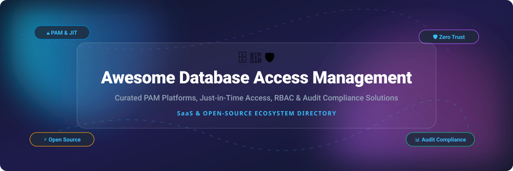

<div align="center">

<a href="https://github.com/ishandutta2007/Awesome-Awesome-Awesome"></a>
<a href="https://discord.gg/jc4xtF58Ve"></a>
<a href="https://github.com/ishandutta2007/Awesome-Database-Access-Management/stargazers"></a>
<a href="https://github.com/ishandutta2007/Awesome-Database-Access-Management/network/members"></a>
<a href="https://github.com/ishandutta2007/Awesome-Database-Access-Management/blob/main/LICENSE"></a>
<a href="https://github.com/ishandutta2007"></a>

<br />
<br />



<h1>🛡️ Awesome Database Access Management 🗄️</h1>

<p>
  <b>A curated list of Privileged Access Management (PAM) platforms, Just-in-Time (JIT) database access tools, Zero-Trust security gateways, and compliance audit frameworks.</b>
</p>

</div>

---

## 📑 Table of Contents
- [🎯 Overview & Key Concepts](#-overview--key-concepts)
- [📊 Market Overview & Industry Structure](#-market-overview--industry-structure)
- [☁️ SaaS & Enterprise PAM Platforms](#-saas--enterprise-pam-platforms)
- [⚡ Open-Source GitHub Projects](#-open-source-github-projects)
- [🛠️ Architecture & Best Practices](#%EF%B8%8F-architecture--best-practices)
- [📈 Star History](#-star-history)
- [🤝 How to Contribute](#-how-to-contribute)
- [💖 Support & Community](#-support--community)
- [⚖️ Disclaimer](#%EF%B8%8F-disclaimer)

---

## 🎯 Overview & Key Concepts

**Database Access Management** encompasses software systems designed to enforce security controls, temporary access grants, credential vaulting, query auditing, and data masking across corporate database infrastructure. Key capabilities include:

- 🔒 **Zero Standing Privileges (ZSP)**: Removing permanent admin access to production databases.
- ⏱️ **Just-In-Time (JIT) Access**: Dynamic approval-based access workflows with automatic time-bound revocation.
- 👁️ **Session Recording & Real-time Audit**: Capturing full query logs and interactive sessions for SOC 2, HIPAA, and ISO 27001 compliance.
- 🔑 **Ephemeral Credentials**: Injecting short-lived tokens or certificates via SSO rather than sharing static passwords.

---

## 📊 Market Overview & Industry Structure

> 📈 **Market Dynamics**: The global **Privileged Access Management (PAM) & Database Access Control** market is valued between **$4.5 Billion and $6.3 Billion**, projecting a rapid **22%–27% CAGR** through 2030. The industry is **moderately fragmented**: enterprise incumbents (CyberArk, IBM/HashiCorp, Delinea) command traditional cloud and legacy PAM deployments, while agile modern SaaS solutions (Teleport, StrongDM) and robust open-source platforms (JumpServer, Teleport, Bytebase) lead the transition toward developer-first Zero-Trust access architectures.

---

## ☁️ SaaS & Enterprise PAM Platforms

The following SaaS platforms provide managed Privileged Access Management, database connection proxying, zero-trust infrastructure access, and enterprise compliance reporting.

*Table sorted by **Company Size / Valuation** (Descending).*

| Product & Overview | Company Size (Valuation / Revenue) | Starting Pricing | Free Tier / Trial Limits |
| :--- | :--- | :--- | :--- |
| **[CyberArk](https://www.cyberark.com/)** 🛡️<br>Enterprise-grade Privileged Access Manager offering isolated database access, credential vaulting, session recording, and automated threat analytics. | **$14.5 Billion** Market Cap<br>*(~$1.0B ARR)* | **$15.00 / user / month** *(Identity PAM Cloud Starter)* | **14-day free trial** *(up to 100 users, full enterprise features)* |
| **[HashiCorp Boundary](https://www.hashicorp.com/products/boundary)** 🔒<br>Identity-based access management providing fine-grained, secure remote access to databases and hosts without exposing static credentials. | **$6.4 Billion** Valuation<br>*(Acquired by IBM)* | **$1.50 / worker-hour** *(~ $0.05 / session-hour)* | **Free Forever Tier** *(up to 5 self-managed workers, 10 users & $50 free HCP credits)* |
| **[One Identity Safeguard](https://www.oneidentity.com/)** 🔑<br>Privileged account management platform delivering database access control, session monitoring, password vaulting, and risk analytics. | **$4.3 Billion** Valuation<br>*(Parent: Quest Software)* | **$1,500.00 / year** *(Base appliance / server licensing model)* | **30-day evaluated trial** *(Full PAM evaluation suite access)* |
| **[Delinea Secret Server](https://delinea.com/)** 💼<br>Comprehensive PAM platform providing privileged credential discovery, enterprise vaulting, database activity monitoring, and workflow approvals. | **$2.0 Billion** Valuation<br>*(Acquired by TPG Capital)* | **$10.00 / user / month** *(Cloud Vault starter package)* | **30-day free trial** *(Up to 25 users and 250 stored secrets)* |
| **[Teleport Cloud](https://goteleport.com/)** ⚡<br>Zero-trust infrastructure access platform with support for PostgreSQL, MySQL, MongoDB, Redis, Snowflake, and SQL Server using ephemeral certs. | **$1.1 Billion** Valuation<br>*(Series C funding)* | **$15.00 / user / month** *(or $50.00 / node / month)* | **14-day free trial** *(Teleport Cloud) & free self-hosted open-core edition* |
| **[ManageEngine PAM360](https://www.manageengine.com/)** 🏛️<br>Complete enterprise PAM suite providing privileged access governance, database session recording, password rotation, and audit logs. | **$1.0 Billion+** Revenue<br>*(Parent: Zoho Corp)* | **$2,995.00 / year** *(Standard Edition for up to 10 admins)* | **30-day free trial** *(Up to 5 administrator accounts)* |
| **[StrongDM](https://www.strongdm.com/)** 🚀<br>Zero-Trust Privileged Access Management platform encapsulating database authentication, authorization, RBAC, and observability without local user credentials. | **$1.0 Billion** Valuation<br>*(~$63M Series B funding)* | **$70.00 / user / month** *(Standard User Plan)* | **14-day free trial** *(Unlimited users & database resources)* |
| **[Axiomatics](https://www.axiomatics.com/)** 🔐<br>Dynamic Attribute-Based Access Control (ABAC) engine for fine-grained database and application authorization enforcement. | **~$100 Million** Valuation<br>*(~$30M annual revenue)* | **$25,000.00 / year** *(Enterprise Policy Server instance)* | **30-day evaluated trial** *(Sandbox environment & SDK access)* |
| **[DataSunrise](https://www.datasunrise.com/)** ☀️<br>Database security, firewall, dynamic data masking, and compliance monitoring software for enterprise databases. | **~$15 Million** Revenue<br>*(Independent security vendor)* | **$0.40 / hour** per instance *(AWS / Azure Marketplace)* | **14-day free trial** *(AWS & Azure Marketplace test AMI)* |

---

## ⚡ Open-Source GitHub Projects

Production-proven open-source tools and platforms providing self-hosted database access control, privilege management, and database consoles.

*Table sorted by **GitHub Star Count** (Descending).*

| Repository & Description | Star Count Badge | License | Primary Tech Stack | Key Capabilities |
| :--- | :--- | :--- | :--- | :--- |
| **[DBeaver](https://github.com/dbeaver/dbeaver)** 🦫<br>Universal database tool and administration client for relational and NoSQL databases. | [](https://github.com/dbeaver/dbeaver/stargazers) | Apache-2.0 | Java / Eclipse | Multi-DBMS support, ER diagrams, data editor, security profiles, connection vaulting. |
| **[JumpServer](https://github.com/jumpserver/jumpserver)** 🌐<br>The leading open-source Privileged Access Management (PAM) platform. | [](https://github.com/jumpserver/jumpserver/stargazers) | GPL-3.0 | Python / Vue | Web-based bastion host, multi-protocol access (DB, SSH, RDP, K8s), session replay, RBAC. |
| **[Teleport](https://github.com/gravitational/teleport)** 🔐<br>Open-core identity-aware access proxy for databases, servers, and Kubernetes clusters. | [](https://github.com/gravitational/teleport/stargazers) | AGPL-3.0 | Go | Ephemeral X.509/SSH certificates, fine-grained database RBAC, web audit console, zero static keys. |
| **[Beekeeper Studio](https://github.com/beekeeper-studio/beekeeper-studio)** 🐝<br>Modern, intuitive open-source SQL editor and database manager. | [](https://github.com/beekeeper-studio/beekeeper-studio/stargazers) | GPL-3.0 | TypeScript / Vue | Encrypted connection storage, query builder, SSH tunneling, table editor. |
| **[Bytebase](https://github.com/bytebase/bytebase)** 🧱<br>Database DevOps and access governance platform for developer teams. | [](https://github.com/bytebase/bytebase/stargazers) | Apache-2.0 / BSL | Go / Vue | Web SQL editor, schema change approval workflows, data masking, granular database RBAC. |
| **[HashiCorp Boundary](https://github.com/hashicorp/boundary)** 🛡️<br>Identity-based access management project for dynamic infrastructure access. | [](https://github.com/hashicorp/boundary/stargazers) | MPL-2.0 / BSL | Go | OIDC authentication, target authorization, dynamic credentials, worker routing. |
| **[DbGate](https://github.com/dbgate/dbgate)** 🚪<br>Cross-platform smart database management client for Windows, Linux, macOS, and Web. | [](https://github.com/dbgate/dbgate/stargazers) | MIT | Svelte / TypeScript | Web & desktop UI, schema comparison, query designer, multi-db connector. |
| **[CloudDM](https://github.com/edurt/CloudDM)** ☁️<br>Open-source database management console with work orders and approval workflows. | [](https://github.com/edurt/CloudDM/stargazers) | Apache-2.0 | Java / React | Work order approvals, database CI/CD, query auditing, RBAC data source isolation. |
| **[Thand Agent](https://github.com/thand-io/agent)** ⏱️<br>Distributed agent for Just-in-Time (JIT) access and zero standing privileges. | [](https://github.com/thand-io/agent/stargazers) | BSL-1.1 | Go / Temporal | Serverless workflow orchestration, zero static credentials, automated permission revocation. |
| **[Jaxon DbAdmin](https://github.com/lagdo/dbadmin-app-laravel)** 🐘<br>Web-based database administration package built with Laravel and Jaxon. | [](https://github.com/lagdo/dbadmin-app-laravel/stargazers) | BSD-3-Clause | PHP / Laravel | Embeddable DB admin UI, dedicated audit logs, tabbed database browsing. |

---

## 🛠️ Architecture & Best Practices

When building or selecting a Database Access Management solution, evaluate the following architectural layers:

```
[ Developer / Admin ]
        │
        ▼ (SSO / OIDC Authentication)
[ PAM / Access Proxy Gateway ] (JIT Approval & RBAC Enforcement)
        │
        ├─► [ Credential Vault / Ephemeral Cert Issuer ]
        ├─► [ Audit & Session Recording Logger ]
        │
        ▼ (Encrypted Connection)
[ Target Database Cluster ] (PostgreSQL, MySQL, MongoDB, Snowflake)
```

1. **Eliminate Static Passwords**: Deploy short-lived TLS/SSH certificates or temporary DB tokens generated on-the-fly via your Identity Provider (Okta, Azure AD, Keycloak).
2. **Implement Approval Workflows**: Wire database access requests into Slack or Teams using JIT triggers (e.g., Teleport Access Requests or Bytebase Work Orders).
3. **Audit & Anonymize**: Apply dynamic data masking to sensitive columns (PII, SSN, Credit Cards) during query execution and retain full immutable session logs.

---

## 📈 Star History

[](https://star-history.dera.page/#ishandutta2007/Awesome-Database-Access-Management&type=date&legend=top-left)

---

## 🤝 How to Contribute

Contributions are welcome! Please follow these simple guidelines:

1. Fork this repository.
2. Add your SaaS or Open-Source tool under the appropriate section.
3. Ensure exact starting pricing, free tier limits, and verifiable GitHub star counts are specified.
4. Keep descriptions concise, factual, and neutral.
5. Create a Pull Request with a clear summary of your additions.

Read the curated collection guidelines at [Awesome-Awesome-Awesome](https://github.com/ishandutta2007/Awesome-Awesome-Awesome).

---

## 💖 Support & Community

Thank you for exploring **Awesome Database Access Management**! If this repository has helped your security team or organization choose the right PAM tool:

- 🌟 **Star this repository** to help others discover it.
- 🔀 **Fork and Contribute** to keep the ecosystem listings current.
- 📢 **Share with your network** on X/Twitter, LinkedIn, or tech communities.
- ☕ **Sponsor the Project**: [Support via GitHub Sponsors](https://github.com/sponsors/ishandutta2007)

---

## ⚖️ Disclaimer

*This repository is a community-curated directory intended for informational and educational purposes. Mention of commercial products does not constitute an endorsement. Database security platforms handle highly sensitive privileges; ensure proper compliance testing (SOC 2, ISO 27001, PCI DSS, HIPAA) before deploying to production systems.*

---

<div align="center">
  <sub>Made with ❤️ by <a href="https://github.com/ishandutta2007">Ishan Dutta</a> and community contributors.</sub>
</div>
